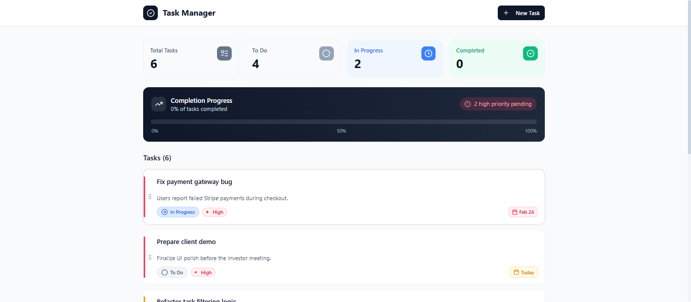
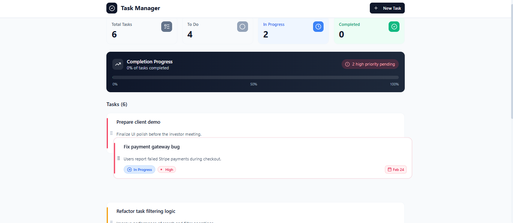

# 🚀 Task Manager Pro

A modern, responsive task management web app built with **React + TypeScript** featuring drag-and-drop reordering, inline editing, smart due dates, and a beautiful UI.

🔗 **Live Demo:** https://nowshinnirjhor.me/taskmanager
💻 **Source Code:** https://github.com/Nirjhor1357/TaskManagerPro

---

## ✨ Features

* ✅ Create, edit, and delete tasks
* 🔄 Drag-and-drop task reordering (DnD Kit)
* ⚡ Inline quick edit for task titles
* 🎯 Priority levels (Low / Medium / High)
* 📅 Smart due date indicators (Today / Tomorrow / Overdue)
* 🔍 Search and filter tasks
* 💾 LocalStorage persistence
* 🎨 Smooth animations with Framer Motion
* 📱 Fully responsive design

---

## 🧱 Tech Stack

**Frontend**

* React
* TypeScript
* Vite
* Tailwind CSS

**Libraries**

* @dnd-kit/core
* @dnd-kit/sortable
* Framer Motion
* date-fns
* lucide-react

---

## 📸 Screenshots

> *(Add your screenshots here for maximum portfolio impact)*

Example:

```md


```

---

## 🚀 Getting Started

### 1️⃣ Clone the repository

```bash
git clone https://github.com/Nirjhor1357/TaskManagerPro.git
cd TaskManagerPro/app
```

### 2️⃣ Install dependencies

```bash
npm install
```

### 3️⃣ Run development server

```bash
npm run dev
```

App will run at:

```
http://localhost:5173
```

---

## 🏗️ Build for production

```bash
npm run build
npm run preview
```

---

## 🌐 Deployment

The app is deployed on **Vercel** and served under a subpath:

```
https://nowshinnirjhor.me/taskmanager
```

---

## 🧠 What I Learned

* Implementing drag-and-drop with DnD Kit
* Managing complex React state with custom hooks
* Type-safe architecture using TypeScript
* Handling subpath deployment in Vite
* Building clean, reusable UI components

---

## 🔮 Future Improvements

* [ ] Dark mode
* [ ] Task categories with colors
* [ ] Cloud sync (Firebase/Supabase)
* [ ] Mobile swipe gestures
* [ ] Due date notifications

---

## 👨‍💻 Author

**Nirjhor**

* 🌐 Portfolio: https://nowshinnirjhor.me
* 💻 GitHub: https://github.com/Nirjhor1357

---

⭐ If you like this project, consider giving it a star!
